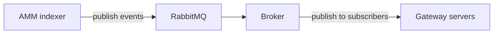

# AMM indexer

Blockchain indexer for **GiWaTer Universal Router** (`GiwaUniversalRouter` in `@giwater/shared`). It follows on-chain logs from that contract and persists structured **AMM activity**—swaps, liquidity changes, and new pairs/pools—into **PostgreSQL** for analytics, history, and product features.

It also **publishes normalized indexer events to RabbitMQ**. The **`apps/broker`** service consumes those messages and **republishes** them so **`apps/gateway`** (and any other connected gateway instances) can stream real-time updates to clients.

## What gets indexed

| Activity | Description |
|----------|-------------|
| **Swaps** | Token swaps routed through the universal router (basic and concentrated-liquidity paths). |
| **Add / remove liquidity** | Liquidity provision and withdrawal events attributed to router flows. |
| **Add pair / pool** | New pool or pair creation events emitted by the router (e.g. basic vs CL pools). |

Exact event names and payloads come from the deployed router ABI. The canonical ABI JSON in this monorepo is `packages/shared/src/abis/json/GiwaUniversalRouter.json` (exported as `GiwaUniversalRouterAbi`).

## Stack

- **[Ponder](https://ponder.sh/)** — indexing pipeline, schema, and sync to Postgres.
- **viem** — RPC and decoding.
- **Hono** — HTTP API in front of the indexed database.
- **PostgreSQL** — durable store for indexed rows (Ponder’s default production database).
- **RabbitMQ** — message bus; indexer produces events, broker fans them out to gateways.

## Event distribution (RabbitMQ → broker → gateway)



1. **AMM indexer** — After handling on-chain events (and writing to Postgres), publishes messages to RabbitMQ (exchanges/queues as agreed with the broker deployment).
2. **Broker** — Subscribes to the indexer’s queues, applies routing rules, and publishes to downstream channels so multiple gateway processes can receive the same stream.
3. **Gateway** — Maintains connections to the broker and pushes updates to connected clients (WebSockets or similar), keeping the UI or API consumers in sync with chain activity without polling Postgres.

See **`apps/broker`** and **`apps/gateway`** for service-specific configuration and protocols.

## Prerequisites

- Node.js **≥ 18.14**
- A reachable **Ethereum (or target chain) RPC** endpoint.
- A **PostgreSQL** instance and connection string (for non-dev / production-style runs; see Ponder docs for local SQLite vs Postgres).
- **RabbitMQ** reachable from the indexer when outbound messaging is enabled, plus a running **broker** if you rely on the full pipeline to gateways.

## Environment variables

Configure at least:

| Variable | Purpose |
|----------|---------|
| `PONDER_RPC_URL_1` | HTTP RPC for chain id `1` (see `ponder.config.ts`; adjust chain keys if you target another network). |
| `DATABASE_URL` | Postgres connection URL when using Postgres (Ponder convention). |
| *(when implemented)* RabbitMQ / AMQP URL | Connection string for publishing indexer events to the broker pipeline (exact variable names follow the app’s config module). |

Add any other `PONDER_RPC_URL_*` keys to match the `chains` block in `ponder.config.ts`.

## Scripts

```bash
pnpm install
pnpm dev      # ponder dev — development with hot reload
pnpm start    # ponder start — production-style run
pnpm db       # ponder db — database utilities
pnpm codegen  # ponder codegen
pnpm typecheck
pnpm lint
```

Run these from `apps/amm-indexer` (or via your monorepo’s package filter, if wired).

## HTTP API

After the indexer is running, the app exposes:

- **GraphQL** — `/` and `/graphql` (see `src/api/index.ts`).
- **SQL** — `/sql/*` for introspection/query patterns supported by Ponder’s client.

Use these to read indexed swap, liquidity, and pair/pool records without talking to the chain directly.

## Project layout

```
apps/amm-indexer/
├── ponder.config.ts    # Chains, contract address(es), start block, ABI
├── ponder.schema.ts    # Postgres tables (onchain tables)
├── src/
│   ├── index.ts        # Event handlers → insert/update schema
│   └── api/index.ts    # Hono + GraphQL + SQL
└── abis/               # Contract ABIs used by Ponder
```

## Wiring the real router

The scaffold may still point at a placeholder contract in `ponder.config.ts`. To index GiWaTer production traffic:

1. Set the **deployed Universal Router address** and **start block** in `ponder.config.ts`.
2. Replace or import the **GiwaUniversalRouter** ABI (from `@giwater/shared` or the contract repo).
3. Define tables in `ponder.schema.ts` for swaps, liquidity events, and pair/pool creation.
4. Implement handlers in `src/index.ts` that map each relevant `event` to those tables.
5. Where applicable, emit the same logical event to **RabbitMQ** after a successful write so the broker can forward it to gateway servers.

Smart contract source and deployment details for GiWaTer live in the separate **Giwater-Contract** repository (read-only from this app’s perspective).

## Related code in this monorepo

- **`@giwater/shared`** — `GiwaUniversalRouterAbi` and types used by the web app and API.
- **`apps/api`** — `event-types.ts` and `event-parser.ts` map router log topics to logical event types for the backend indexer/sync path; useful reference when aligning Ponder handlers with existing semantics.
- **`apps/broker`** — RabbitMQ-facing service that receives indexer events and republishes them for downstream consumers.
- **`apps/gateway`** — Connects to the broker and serves real-time updates to attached clients.
