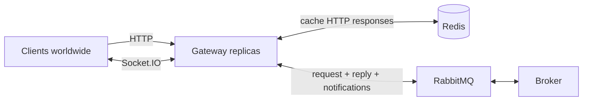

# Gateway server

The **gateway** is the **edge** **NestJS** service that **HTTP** and **Socket.IO** clients talk to. Users connect from **many regions**; each gateway instance accepts requests, coordinates with **`apps/broker`** over **RabbitMQ** (request data and receive push notifications), and **streams** live updates to browsers and apps over **Socket.IO**.

## Role in the platform

| Responsibility | Description |
|----------------|-------------|
| **Public HTTP API** | Handles REST or similar HTTP calls from clients worldwide (routing, auth, validation at the edge). |
| **Broker integration via RabbitMQ** | For data that lives behind the broker (e.g. trading aggregates, OHLCV, **`indexed_events`**-backed swap hop lists), the gateway **publishes a message** and waits for a **response** (or uses a request–reply pattern). The broker **also pushes notifications** to the gateway when new trading data or events are ready. |
| **Real-time streaming** | Between **client and gateway**, connections use **Socket.IO** so candles, trades, and other updates can be **pushed** without polling. |
| **Horizontal scale** | Gateway runs as **multiple replicas** (e.g. on **Railway**); see [Replicas and Socket.IO](#replicas-and-socketio-railway) below. |
| **HTTP cache (Redis)** | **Redis** caches **HTTP** handler results (e.g. broker RPC responses) so repeat reads avoid duplicate RabbitMQ round-trips and reduce latency for global clients. |
| **API documentation** | **NestJS** with **`@nestjs/swagger`** generates **OpenAPI** from controllers/DTOs and serves **Swagger UI** for interactive docs. **AsyncAPI** documents event-driven contracts (Socket.IO channels, payload shapes, and how they relate to broker notifications). |

## API documentation (NestJS, Swagger, AsyncAPI)

The gateway is a **NestJS** app; HTTP docs ship as **OpenAPI** plus **Swagger UI** (same pattern as **`apps/api`**):

| Piece | Role |
|------|------|
| **NestJS + `@nestjs/swagger`** | **`DocumentBuilder`**, **`SwaggerModule.createDocument`**, and **`SwaggerModule.setup`** build the OpenAPI spec from decorators (`@ApiTags`, `@ApiOperation`, `@ApiResponse`, DTOs with `@ApiProperty`, etc.). |
| **Swagger UI** | Interactive “try it” browser UI (e.g. mounted at **`/api-docs`** or **`/docs`**—choose one path and keep it consistent across environments). |
| **AsyncAPI** | Describes **asynchronous** behavior: Socket.IO events (emit/listen names and payloads), optional correlation with RabbitMQ message types, and streaming semantics so client and gateway teams share one contract (static file or separate tooling; not generated by `@nestjs/swagger`). |

Typical setup: in `main.ts` (or a dedicated bootstrap helper), call **`SwaggerModule.setup('api-docs', app, document)`** (path is arbitrary). The raw JSON is available from the same stack for codegen clients. Publish **AsyncAPI** at `/asyncapi.json` or via **AsyncAPI Studio** / a static viewer linked from this README.

## HTTP response cache (Redis)

**Implementation:** `HttpCacheModule` registers a global **`HttpCacheInterceptor`** (`APP_INTERCEPTOR`) for **GET** requests whose `originalUrl` is not under an excluded prefix (defaults: `/api/health`, `/api/docs`; see `REDIS_HTTP_CACHE_EXCLUDE_URL_PREFIXES`). Opt out per handler with `@SkipHttpCache()` (`src/http-cache/skip-http-cache.decorator.ts`).

1. **Cache key** — `METHOD:originalUrl` (e.g. `GET:/spot-tokens/leaderboard/day-change/desc?offset=0&limit=50&listed=true`).
2. **Stored value** — JSON envelope `{ body, storedAtMs }` so the gateway can mark **fresh** vs **stale** without a second Redis field.
3. **TTL** — Redis `EX` = `REDIS_HTTP_CACHE_TTL_SEC` (**fresh**) + `REDIS_HTTP_CACHE_STALE_EXTRA_TTL_SEC` (**stale** window). Response header `X-Gateway-Http-Cache` is `HIT`, `STALE`, or `MISS` when caching applies.
4. **Miss** — Handler runs (typically RabbitMQ RPC to the broker), then the interceptor **SET**s the envelope.

### Broker → gateway: cache control over the notify queue

`GatewayRabbitmqService` parses each JSON notification and handles **structured** payloads first (no legacy `notify` broadcast for these):

| Schema (`@giwater/shared`) | Handler | Client impact |
|----------------------------|---------|----------------|
| `broker.gateway.http-cache-upsert/v1` | `GatewayHttpCacheUpsertService` | **SET** each `entries[]` key with the same envelope/TTL as the interceptor. If **`wsEmit`** is set, forwards **`BrokerGatewayWsEmitV1`** through `GatewayEventsService` (room + event + data). |
| `broker.gateway.http-cache-invalidate/v1` | `GatewayHttpCacheInvalidationService` | **SCAN** + **UNLINK** keys matching each `keyPrefix`. No Socket.IO. |
| (else) | Existing bridge | `BrokerGatewayWsEmitV1` → room emit; other payloads → global **`notify`**. |

See **`apps/broker/src/emitter/README.md`** for which broker services publish invalidate vs upsert, and **`apps/broker/src/aggregator/event/`** for aggregator-defined **`wsEmit.data`** shapes (e.g. spot token leaderboards `kind`).

The same Redis deployment can back **both** HTTP caching and the **Socket.IO Redis adapter**; use **key prefixes** (e.g. `gateway:http:`, `socket.io:`) or separate **logical databases** (`SELECT`) so namespaces stay clear.

## Request and notification flows

### HTTP → Redis → (optional) RabbitMQ → broker

1. Client sends an **HTTP** request to a gateway replica (any region-facing URL or load-balanced host).
2. Gateway checks **Redis** for a cached response for that request fingerprint.
3. If **miss**, the gateway **does not** read the trading database directly; it **sends a RabbitMQ message** to the broker (correlation id, routing key, or queue contract as defined in implementation).
4. Broker **fulfills** the request (e.g. reads trading DB, runs a query path) and **replies** on the agreed reply queue or channel.
5. Gateway **writes** the successful response to Redis (when caching applies) and returns it to the client.

### Broker → RabbitMQ → gateway (notifications)

1. Broker completes work (e.g. new OHLCV bucket, indexer-derived event relay).
2. Broker **publishes a notification** to a queue or exchange that **all gateway replicas** consume (or that is fanned out per subscription model).
3. Each gateway instance **forwards** relevant updates to **Socket.IO** rooms or user sessions it currently holds, and may **invalidate**, **upsert**, or shorten TTL for related **Redis** HTTP cache keys (see [HTTP response cache](#http-response-cache-redis) table above).



## Client transport

- **HTTP** — Queries, mutations, and responses that fit a request–response model.
- **Socket.IO** — Long-lived connections for **streaming** updates (OHLCV refreshes, live activity, subscription-based channels). Socket.IO runs on the **same gateway process** (or behind the same service) that handles HTTP, so clients can share session identity between both.

**Implementation prompt (Nest gateways ↔ `socket.io-client`):** see [`apps/gateway/prompts/nest-gateway-client-connection.md`](prompts/nest-gateway-client-connection.md), based on the official **[NestJS Gateways](https://docs.nestjs.com/websockets/gateways)** guide.

**Broker HTTP = gateway contract (RabbitMQ `apiInvoke`):** whenever you add a broker REST route, mirror it in the broker’s `GatewayRpcInvokeService` so `POST /api/v1/broker/invoke` and Socket.IO `broker.invoke` stay equivalent—see [`apps/gateway/prompts/broker-gateway-api-parity.md`](prompts/broker-gateway-api-parity.md) and the canonical checklist in [`apps/broker/prompts/gateway-rpc-fanout.md`](../broker/prompts/gateway-rpc-fanout.md).

## Replicas and Socket.IO (Railway)

Gateway is deployed as **several replicas** on **Railway** (or similar) for availability and throughput.

Implications:

- **Load balancing** — HTTP requests can hit **any** replica; **Redis** makes per-route response caching **shared across replicas**, so a cache hit is fast regardless of which instance handled the previous request (same key/TTL discipline required).
- **Socket.IO affinity** — A given browser tab is tied to **one** replica’s in-memory socket state. Use **sticky sessions** (session affinity) on the load balancer so reconnects and long-polling upgrades stay on the same instance, **or** use a **Socket.IO Redis adapter** (or equivalent) so **all replicas** share room and broadcast state. Without one of these, broadcasts initiated on replica A may not reach sockets attached to replica B.
- **RabbitMQ consumers** — Each replica may run a **consumer** for broker notifications; use **competing consumers** only if every message should be handled once globally, or **fan-out** (per-replica queues) if each replica must receive a copy to push to its own connected clients. The right pattern depends on whether notifications are “broadcast to all gateways” (fan-out) or “exactly one worker” (single queue).

Document the chosen pattern when the service is implemented.

## Environment variables (illustrative)

| Variable | Purpose |
|----------|---------|
| `PORT` / `HTTP_PORT` | HTTP and Socket.IO server bind port. |
| RabbitMQ URL | `amqp://…` — publish RPC to broker, consume notifications. |
| Queue / exchange names | Request, reply, and notification routing (as agreed with broker). |
| CORS / trusted origins | Browser clients from your web app origins. |
| Redis URL | **HTTP response cache** (broker fetch results); optional **Socket.IO Redis adapter** for multi-replica broadcasts (same or separate instance; use key prefixes / DB index). |
| `REDIS_HTTP_CACHE_TTL_SEC` | Fresh window (seconds) for cached GET bodies. |
| `REDIS_HTTP_CACHE_STALE_EXTRA_TTL_SEC` | Extra seconds the same Redis entry may still be served as **STALE** after the fresh window. |
| `REDIS_HTTP_CACHE_EXCLUDE_URL_PREFIXES` | Comma-separated `originalUrl` prefixes to skip caching (optional; defaults in `configuration.ts`). |
| Railway / public URL | Base URL for client apps; may differ per region if you add regional deployments later. |

## Related apps

- **`apps/broker`** — Source of trading data and push notifications; gateway’s RabbitMQ peer.
- **`apps/amm-indexer`** — Upstream indexer; clients do not talk to it directly through the gateway for raw chain data unless you add that path explicitly.

## Implemented stack (this repo)

| Path | Role |
|------|------|
| `GET /api/health` | Liveness JSON |
| `GET /api/v1/broker/ping` | RabbitMQ RPC `{ action: 'ping' }` → broker; **Redis-cached** GET (global `HttpCacheInterceptor`) |
| Parity `GET /…` (e.g. `/spot-tokens/…`, `/swap-routes`) | Same global GET cache + broker RPC via `GatewayRabbitmqService` |
| `channels.subscribe` | Valid rooms: `pair:0x…40 hex`, `token:0x…`, **`spot-tokens:leaderboards`** (leaderboard snapshot pushes) |
| `POST /api/v1/broker/invoke` | HTTP-shaped async broker API: body `BrokerGatewayHttpLikeRequest` (`method`, `path`, optional `query`, `body`) → RPC `action: apiInvoke` → returns broker `body` on success (see `@giwater/shared` `BrokerGatewayRpcResponseDto`) |
| `GET /api-docs` | Swagger UI |
| Socket.IO `/` | Client `ping` → server `pong`; **`broker.invoke`** → same RPC as `POST …/invoke` (events `broker.invoke.result` / `broker.invoke.error`); broker fan-out on topic exchange → `notify` to all clients |

From monorepo root: **`pnpm dev:gateway`** (watch), **`pnpm build:gateway`**, **`pnpm start:gateway`** (production `node dist/main.js`). Copy **`.env.example`** to **`.env`**.

## Railway (monorepo root)

| Setting | Value |
|--------|--------|
| **Root directory** | Repository root (`.`) |
| **Build command** | `pnpm railway:gateway:build` |
| **Start command** | `pnpm railway:gateway:start` |

Set **`REDIS_URL`**, **`RABBITMQ_URL`**, and **`PORT`** (Railway injects `PORT`). Ensure **broker** uses the same exchange/queue names (see `apps/broker/.env.example`).

## Project layout

```
apps/gateway/
├── src/
│   ├── api/              # HTTP controllers (broker proxy, …)
│   ├── config/           # ConfigModule load
│   ├── events/           # RxJS bridge: RabbitMQ notify → Socket.IO
│   ├── health/
│   ├── http-cache/       # Redis invalidate / upsert from broker notify + APP_INTERCEPTOR wiring
│   ├── interceptors/     # HttpCacheInterceptor (GET envelope cache)
│   ├── rabbitmq/         # RPC client + per-replica notify queue → exchange
│   ├── redis/
│   ├── ws/               # Nest @WebSocketGateway (Socket.IO)
│   ├── main.ts           # IoAdapter + Swagger
│   └── app.module.ts
├── .env.example
├── prompts/
│   ├── nest-gateway-client-connection.md
│   ├── broker-gateway-api-parity.md
│   └── gateway-broker-rabbitmq-socket-rebuild.md
└── README.md
```

Architecture sections above remain the **target** design; the table in **Implemented stack** reflects what is wired today.
